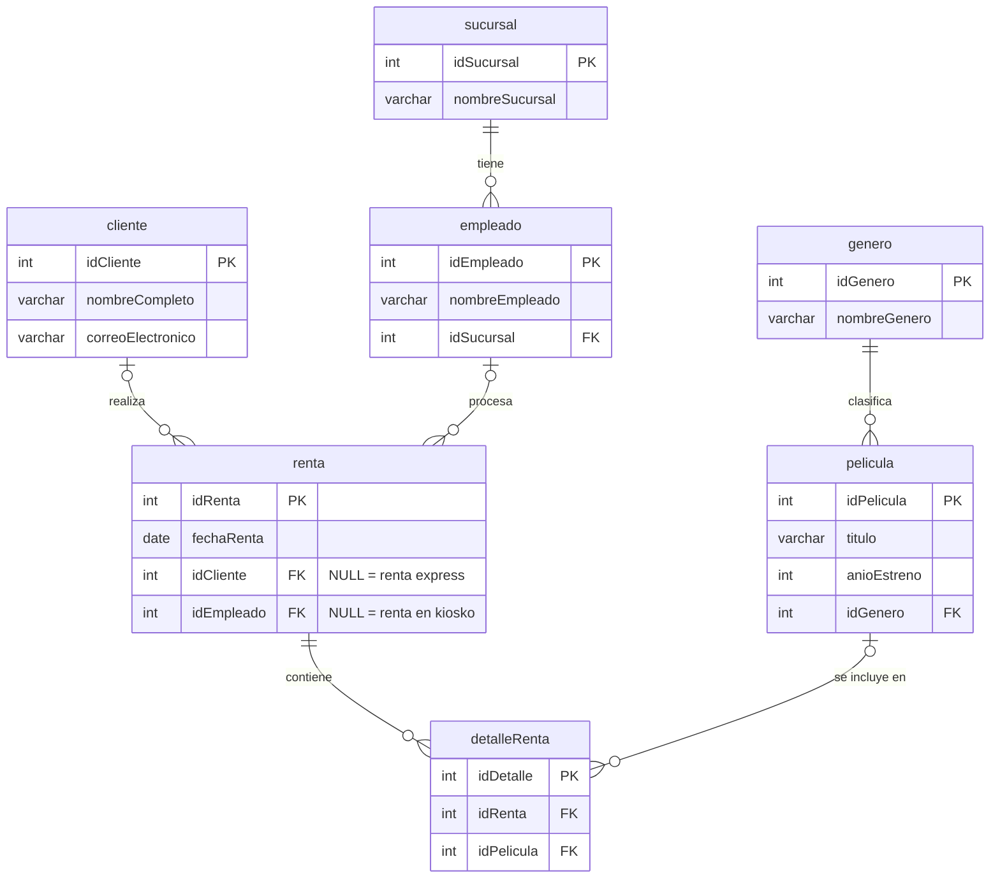

# Blockbuster Reborn – Práctica de SQL JOIN

Blockbuster Reborn es una cadena ficticia de renta de películas físicas que busca modernizarse. Este repositorio contiene el diseño de su base de datos en MySQL, los datos de prueba y un conjunto de reportes de negocio construidos con los distintos tipos de uniones (`INNER`, `LEFT`, `RIGHT` y una emulación de `FULL OUTER JOIN`).

El modelo refleja tres formas de rentar: rentas de **clientes registrados** (que acumulan puntos), rentas **express** sin cliente registrado (`idCliente` nulo) y rentas en **kioskos automáticos** donde no interviene ningún empleado (`idEmpleado` nulo). Estos casos con valores nulos son justamente los que permiten observar la diferencia entre cada tipo de JOIN.

## Diagrama entidad-relación



La tabla `renta` es el centro del modelo: se relaciona opcionalmente con `cliente` y con `empleado`, y se descompone en una o varias líneas de `detalleRenta`, cada una asociada a una `pelicula`, que a su vez pertenece a un `genero`. Cada `empleado` trabaja en una `sucursal`.

## Datos de prueba

Los datos se diseñaron para que cada reporte muestre casos con y sin coincidencia. Hay 5 clientes, de los cuales Laura Valentina Palacio y Santiago Díaz Jaramillo nunca han rentado; 5 películas, de las cuales *Ford vs Ferrari* nunca ha sido rentada; y 5 empleados, de los cuales Juan Pablo Raba Vidal y Víctor Gaviria no han procesado rentas. La renta 3 es una renta express (sin cliente), la renta 4 se hizo en un kiosko (sin empleado) y la renta 1 incluye dos películas (*Star Wars I* y *Godzilla 2000*).

## Reportes de negocio

| Reporte | Pregunta de negocio | Tipo de JOIN |
|---|---|---|
| 1. Ticket de compra completo | Rentas con cliente registrado y película válida, con su género | `INNER JOIN` (4 tablas) |
| 2. Seguimiento de clientes | Todos los clientes, hayan rentado o no | `LEFT JOIN` |
| 3. Auditoría del catálogo | Todas las películas, rentadas o estancadas | `RIGHT JOIN` |
| 4. Rendimiento total | Empleados sin ventas y rentas hechas por kiosko | `LEFT JOIN` + `UNION` + `RIGHT JOIN` (emulación de `FULL OUTER JOIN`) |

Como MySQL no soporta `FULL OUTER JOIN` de forma nativa, el reporte 4 combina con `UNION` un `LEFT JOIN` (que conserva a los empleados sin rentas) y un `RIGHT JOIN` (que conserva las rentas sin empleado). `UNION` elimina las filas duplicadas que ambas consultas tienen en común.

## Estructura del repositorio

```
blockbuster-reborn/
├── 1_esquema_y_datos.sql   # DDL: base de datos y 7 tablas + DML: datos de prueba
├── 2_consultas.sql         # Las 4 consultas de negocio, comentadas por reporte
├── resultados.md           # Tablas de salida de cada consulta
├── capturas/               # Capturas de la ejecución en el cliente SQL
└── README.md
```

## Cómo ejecutarlo

Clona el repositorio y ejecuta los scripts en orden desde MySQL Workbench o desde la terminal:

```bash
git clone https://github.com/USUARIO/blockbuster-reborn.git
cd blockbuster-reborn
mysql -u root -p < 1_esquema_y_datos.sql
mysql -u root -p blockbusterReborn < 2_consultas.sql
```

El primer script elimina la base de datos si ya existe (`DROP DATABASE IF EXISTS`), así que puede ejecutarse varias veces sin errores.

## Tecnologías

- MySQL 8
- MySQL Workbench
- Git y GitHub
- Mermaid (diagrama entidad-relación renderizado por GitHub)

## 👩‍💻 Autora

Laura – Universidad Central
